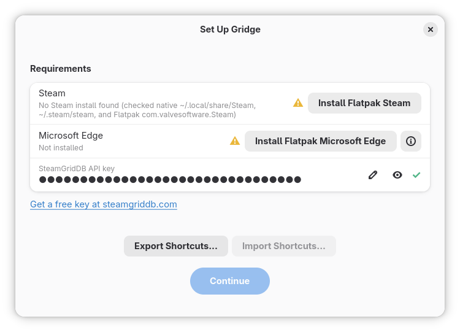

<div align="center">


# Gridge

Streaming and cloud-gaming services as native-looking Steam shortcuts

<a href="LICENSE"></a>
<a href="https://github.com/ScarletPachydermDev/Gridge/releases/latest"></a>
<a href="https://github.com/ScarletPachydermDev/Gridge/issues"></a>

</div>

---

Type a URL or the name of a streaming/cloud-gaming service, and Gridge finds matching artwork on [SteamGridDB](https://www.steamgriddb.com/) and creates a non-Steam shortcut for it -- so it shows up as a native-looking tile in Steam's Game Mode, launching borderless in a kiosk browser window instead of a regular tab. Built with Steam hardware in mind.

## Requirements
1. Steam installed, either native OS package or Flatpak
2. Microsoft Edge
3. SteamGridDB API key



## What it does

Type a URL (`netflix.com`) or a recognized service name (`Netflix`, `Disney+`, `GeForce NOW`, ...), pick matching SteamGridDB artwork (or just go with the defaults), and click Create Steam Shortcut.

Beyond that, Gridge also handles in the background:

- **Installs Steam and/or Microsoft Edge itself** (as Flatpaks) if either is missing, right from onboarding -- no manual terminal commands needed.
- **Removes Edge's first-time setup entirely.** A freshly-installed Edge normally shows its own onboarding wizard, a sign-in nudge, and an auto-opened "what's new" tour tab the first time it runs -- all in a regular browser window, not the kiosk window a shortcut expects. Gridge pre-seeds Edge's profile so none of that ever interrupts a shortcut's first launch.
- **Keeps shortcuts sized correctly in Game Mode**, docked or undocked -- a non-Steam shortcut doesn't get Steam's automatic resolution handling that a real library game gets, so without this a shortcut would stay pinned to whatever resolution it first launched at even after docking to a TV. Gridge's shortcuts detect Gamescope's actual current output resolution and match it every launch.
- **Export and import shortcuts** -- back up the set of shortcuts Gridge created (plus their artwork) as a zip, and restore them on another machine or after a reset, no re-entering URLs or re-picking artwork required.
- ~~**(Planned) Steam Input remapping for easier web navigation in Game Mode** -- not implemented yet.~~ Scrapped, no local files to modify for Steam input per shortcut. 


## Why Microsoft Edge

Every shortcut Gridge creates launches through Microsoft Edge, not a regular system browser or a bundled Electron window. That's a deliberate choice, not a default: **Edge is the only browser on Linux licensed to decode Dolby Digital Plus and Dolby Atmos audio.** Google never licensed those codecs into open-source Chromium, so every other Chromium-based browser (Chrome, Brave, Vivaldi, or a bundled Electron build) inherits the same gap.

This isn't a hypothetical edge case -- plenty of mainstream streaming catalogs use Dolby Atmos/Plus as its sole audio track for supported titles (a large chunk of Disney+'s Marvel/Star Wars library, for instance). When a browser without codec support hits one of these tracks, we get an error or no error at all: video keeps playing, but the audio silently fails or drops out, which is a much worse experience than a browser refusing to load the page. Edge is the one browser that avoids this entirely, so it's the only one Gridge shells out to.

Edge shares one profile across every shortcut Gridge creates, so logins, addons and saved sessions from one streaming service carry over to the others automatically -- you only sign in once per service, not once per shortcut.

## Installing

```
flatpak remote-add --user --if-not-exists flathub https://dl.flathub.org/repo/flathub.flatpakrepo && flatpak remote-add --user --if-not-exists gridge https://raw.githubusercontent.com/ScarletPachydermDev/Gridge/main/packaging/io.github.ScarletPachydermDev.Gridge.flatpakrepo && flatpak install --user gridge io.github.ScarletPachydermDev.Gridge
```

> [!IMPORTANT]
> Flathub repo is included for Gnome runtime

From then on `flatpak update` (or your desktop's automatic background updates, on by default on SteamOS and most GNOME/KDE-based distros) picks up new releases the same way a Flathub app would -- no manual reinstalling.

The `.flatpak` bundle on the [releases page](https://github.com/ScarletPachydermDev/Gridge/releases/latest) also auto-registers the same repo (with its GPG key) on install, so it updates just as securely -- but doesn't have the Flathub fallback above, so it'll fail to install if the GNOME runtime isn't available from anything already configured on your system. Prefer the command above unless you already know Flathub (or the runtime) is set up.

### Why not Flathub?

Gridge was submitted to Flathub, but rejected: the project is too new ([insufficient development history](https://docs.flathub.org/docs/for-app-authors/requirements#insufficient-development-history)) and built with heavy AI assistance ([generative AI policy](https://docs.flathub.org/docs/for-app-authors/requirements#generative-ai-policy)). Both are legitimate policies, and Gridge genuinely doesn't meet them yet -- may try again once that's no longer true.

## Building from source

To build it yourself:

```
flatpak install --user flathub org.gnome.Sdk//50 org.gnome.Platform//50 org.flatpak.Builder
git clone https://github.com/ScarletPachydermDev/Gridge.git
cd Gridge
flatpak run org.flatpak.Builder --user --install --force-clean build-dir packaging/io.github.ScarletPachydermDev.Gridge.json
flatpak run io.github.ScarletPachydermDev.Gridge
```

## Issues

Found a bug, or a streaming service that doesn't work right? [Open an issue](https://github.com/ScarletPachydermDev/Gridge/issues).

## Credits

Built by [ScarletPachydermDev](https://github.com/ScarletPachydermDev) and Claude Code. Artwork sourced from [SteamGridDB](https://www.steamgriddb.com/).

Gridge doesn't share code with any of these, but built on ideas/techniques from:
- [unrud/video-downloader](https://github.com/unrud/video-downloader) -- UI style inspiration (single window, no bells and whistles).
- [SteamGridDB/steam-rom-manager](https://github.com/SteamGridDB/steam-rom-manager) -- the kill/wait/relaunch pattern Gridge's Steam restart uses.
- [loki-47-6F-64/gamescope-mode-change](https://github.com/loki-47-6F-64/gamescope-mode-change) -- discovered the Gamescope X11 property Gridge's shortcuts use to match the display's actual resolution when docking/undocking a Steam Deck.

Vendors [python-xlib](https://github.com/python-xlib/python-xlib) and [six](https://github.com/benjaminp/six) (bundled in `vendor/`, since there's no pip on the Steam Deck's host OS to install them with).

## License

[MIT](LICENSE)

## Disclaimer

Gridge is an unofficial tool; it is not affiliated with, endorsed by, or sponsored by any streaming service.

## Donate

Bitcoin: bc1qw5d4wyc4szjz28e6tafmpd4u9flgqqnjlwuwd8

Monero: 89GucTETmNEUVdbF3HYWYC8Gi3mFdUFvyEaa545E4S8ahq2MfXmGgMzS5q9Kx6k3DG943gXFbn4ECTQFf8Coe5qyEfwxAdM
